# Copilot Studio Agent Quality Reporter

Self-hosted quality scoring for your **Microsoft Copilot Studio agents**. It reads agents live
from the Dataverse Web API, applies a weighted, editable catalogue of patterns and practices plus
an optional LLM instruction-quality judge, and serves per-agent scorecards, findings and history
across every Power Platform environment — instead of a static report. No data leaves your
subscription. Runs anywhere with `docker compose up`, or deploys to Azure Container Apps in one
click.

[](https://portal.azure.com/#create/Microsoft.Template/uri/https%3A%2F%2Fraw.githubusercontent.com%2Floryanstrant%2FAgentQualityReporter%2Fmain%2Finfra%2Fazuredeploy.json/createUIDefinitionUri/https%3A%2F%2Fraw.githubusercontent.com%2Floryanstrant%2FAgentQualityReporter%2Fmain%2Finfra%2FcreateUiDefinition.json)

> Community project, MIT-licensed. Not covered by a Microsoft support agreement.
## Screenshots

> These are **desktop dashboards**. They are built to be read on a laptop or a
> meeting-room screen, and there is deliberately no phone layout.

### Sign in

Password sign-in for the admin account, with Entra single sign-on offered alongside it once a service principal is configured.

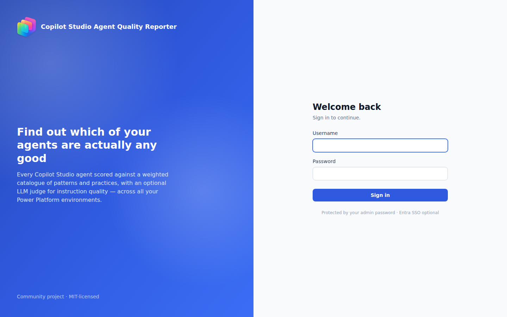

### Your agents

Where anyone signing in with a work account lands: the agents Copilot Studio records *them* as the maker of, how many are scored, the lowest grade among them, and how many findings are still open — with the step across to the organisation view shown, and locked with an explanation when they are outside the approved group.

It also answers "am I doing this well?" two ways: their agents' **average score per scan**, as bars with a trend line over the last three, and **How you compare** — them, their team, and everyone who has created an agent, on agents created and average score.

The wider bar is labelled **All agent creators**, not "Organisation", because that is what it is: this app's comparison population is people recorded as making an agent, which in a real tenant is tens of people out of thousands. Both group series are withheld below five other people — the team *and* the creator population — because a group average next to your own figure identifies somebody whatever the group is called. Your own figures always stay.

The team series is **withheld when the group is smaller than five other people**, and that is a disclosure rule rather than a preference: in a team of two, the team average next to your own figure gives the other person's exact number. Where it is withheld the panel says which of four reasons applies, and one of them is specific to this app — somebody who has never created an agent has no directory record here at all, because the lookup covers agent creators and nobody else. That is not a gap in their Entra profile, and the wording says so.

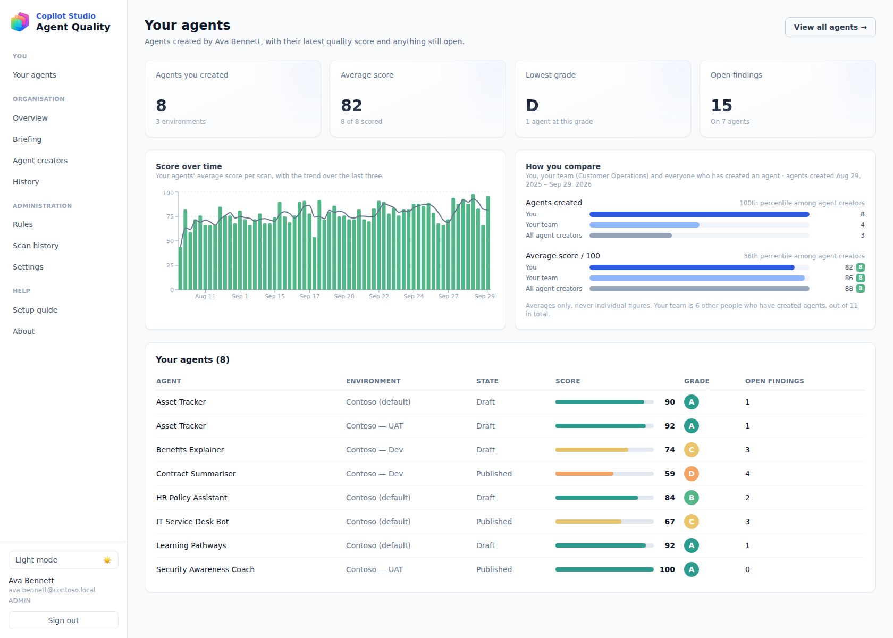

### Overview — every agent, every environment

Pick an environment from the selector, or leave it on **All environments** to see every agent across your tenant, sorted by score. Each row shows the owning solution (display name), publish state, score bar, and grade.

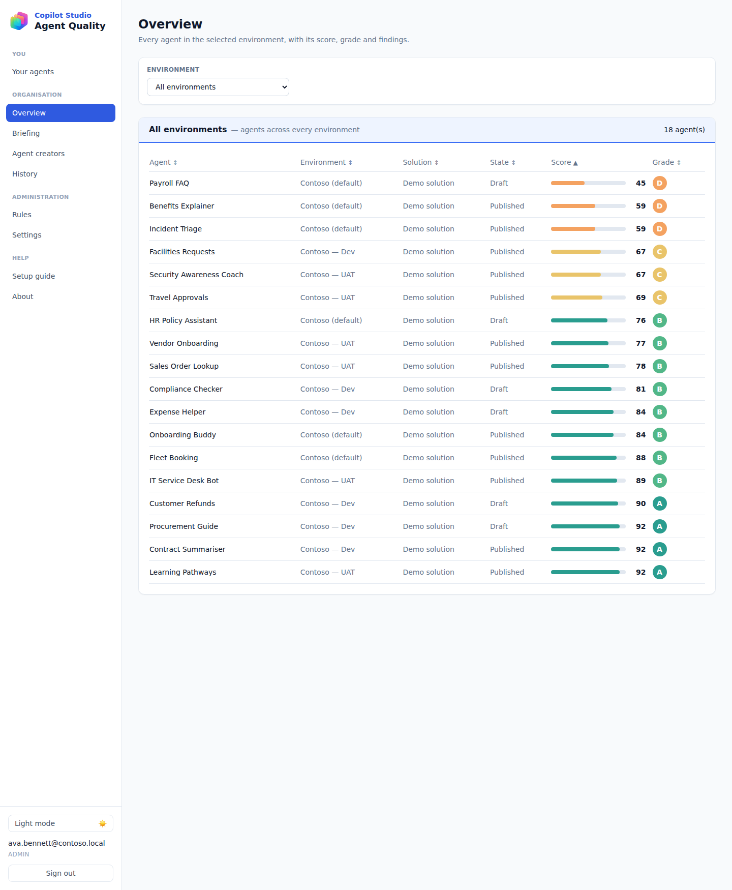

### Executive briefing

The whole tenant in a few sentences: how many agents scored what, the grade mix, open findings by severity, and how all of it has moved since the period before. Every number is calculated from your scans in SQL and every sentence is assembled from fixed thresholds — **there is no model anywhere in this path**, even though the app has an LLM judge configured. A briefing gets read aloud to customers, so it must never be able to invent a figure.

It also names the rules failing on the most agents, which is usually the cheapest thing to fix: one instruction change that clears seven agents at once.

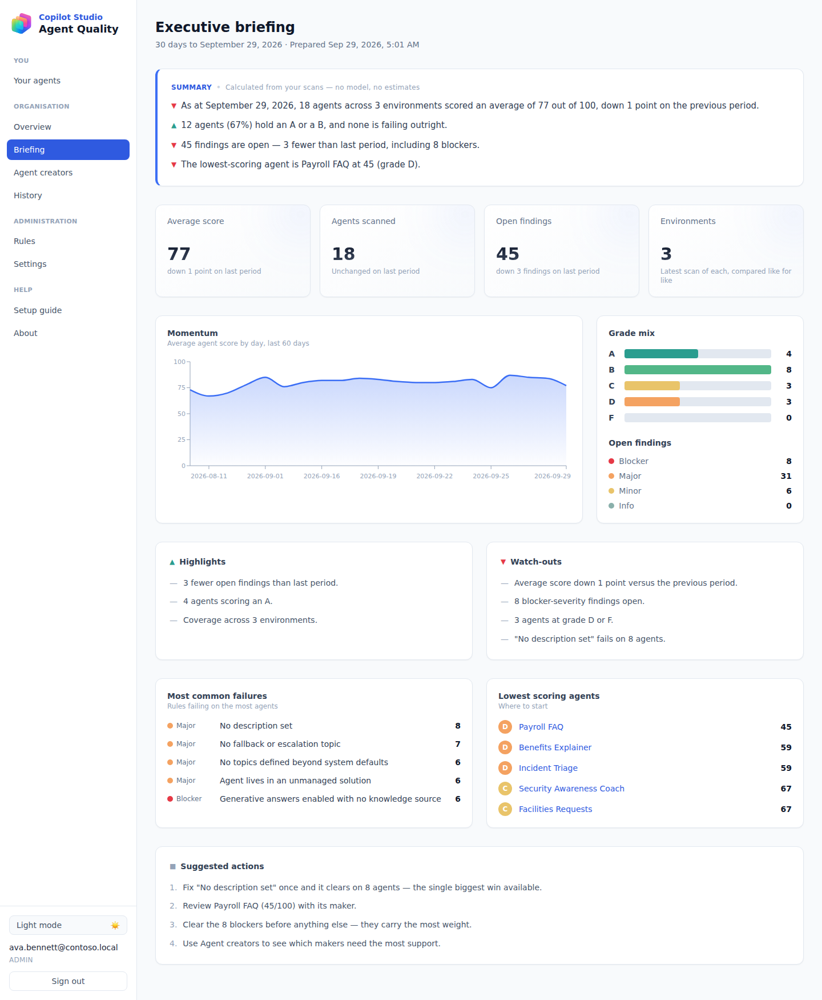

### Agent creators

Who is building the agents, and how their agents score — agent count, average score with its grade, grade spread, open findings and environments, filterable per column and sorted worst-average-first, because the question this page answers is "who needs help".

Names, departments and managers come from **Entra**, looked up for the people already recorded as agent creators — and for nobody else. It is still **not** a tenant directory and does not pretend to be one: somebody who has never built an agent is never looked up and does not appear here.

A creator the lookup cannot resolve — someone who has left, or a service principal that built an agent — is **kept and listed by sign-in address**, with a note saying so. Dropping them would silently remove their agents from the only page that counts them.

This needs the **`User.Read.All`** application permission with admin consent (see *Prerequisites & permissions*). Without it the app still works exactly as it did before: names stay as sign-in addresses, and Settings says which permission is missing rather than leaving you to guess.

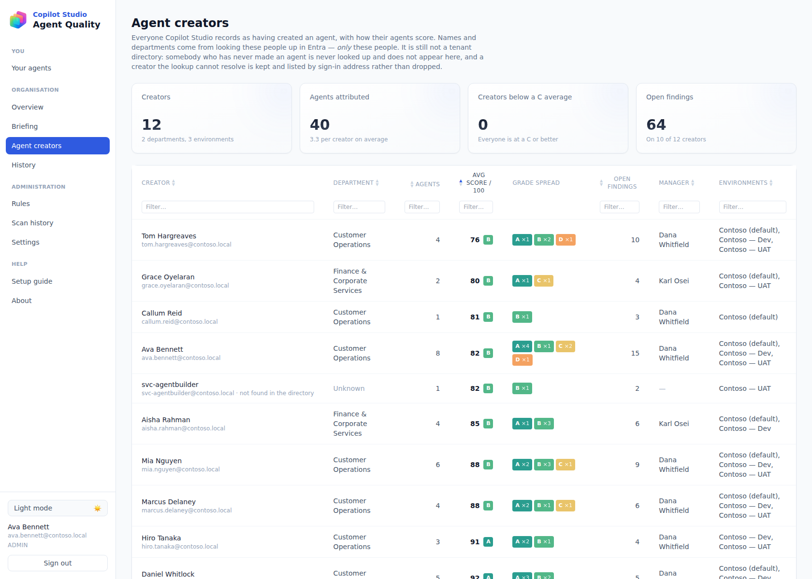

### Agent scorecard

A full breakdown for one agent: score gauge, metadata (created/modified, human creator, model, environment), deep links straight into **Copilot Studio** and the **maker portal**, every rule finding with its explanation and patterns-&-practices reference, live telemetry (when App Insights is connected), and the LLM instruction-quality judge.

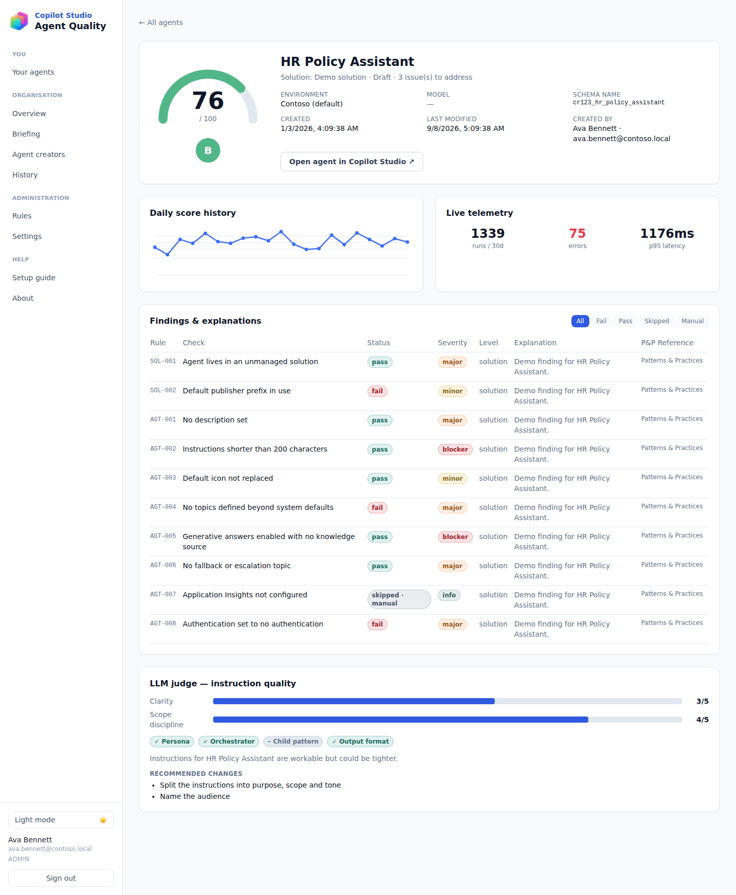

### Settings

Password-protected console: manage environments (add, **edit**, test, scan, delete), scan all environments at once, configure the Dataverse service principal and LLM judge, and open the editable rules catalogue. The version/build stamp and a guided setup wizard live here too.

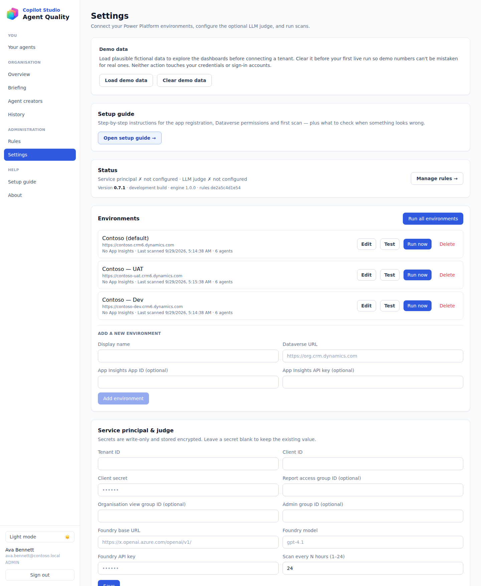

Three separate Entra group fields live here, and they answer three different questions: **Report access** decides who may sign in at all, **Organisation view** decides who may see everyone else's agents, and **Admin group** decides who administers the app — so administration no longer has to be one password passed between people. The admin group **fails closed**: leave it blank and nobody gets admin by single sign-on, which is deliberately the opposite of the organisation-view field.

### Rules

Every rule in the catalogue, editable: enable or disable it, change its scoring weight, or reword the explanation your colleagues read.

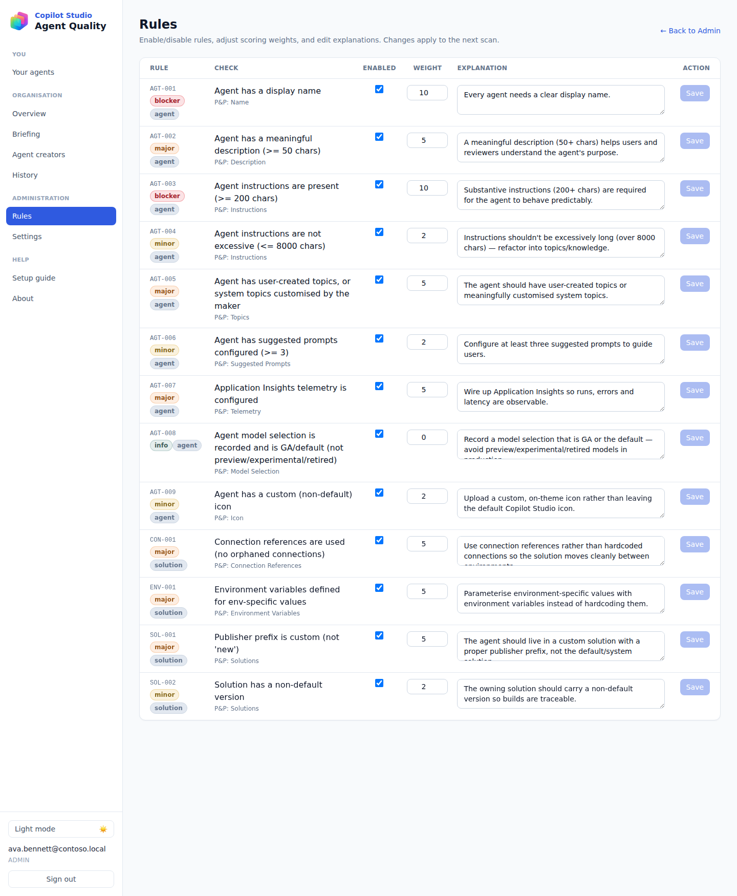

### History

Average score over time, with the **best-to-worst spread shaded behind the line**, so direction and dispersion are read together: an average that climbs while one agent falls apart looks like progress on a plain line and looks like trouble as soon as the band is there. Underneath, the **biggest movers** since each agent was last measured — direction as ▲ ▼ *and* the words up/down, both scores, and both letter grades.

Filterable by environment, creator and agent. Creators are listed by name, because of the lookup above.

One point per scan, and gaps between scans are deliberately not filled in: a day with no scan is not a score of zero, it is no measurement, and drawing it flat would show a collapse that never happened.

### Scan history

The run log, under **Administration**: every scan and every directory lookup, newest first, with what kind it was, how long it took, what it wrote and whether it worked. Failures show their reason, and a scan that finished having scored only some of the agents it found is labelled **part-finished** — which was previously invisible anywhere in the product.

Status is a shape plus a word (● Succeeded · ◐ In progress · ○ Failed), and a status or kind the app does not recognise is shown as itself rather than being filtered out: a run that happened and is not listed is worse than one labelled awkwardly.

This is deliberately **not** the History page above. Both read the scan table; this one answers "did it run", that one answers "is quality moving".

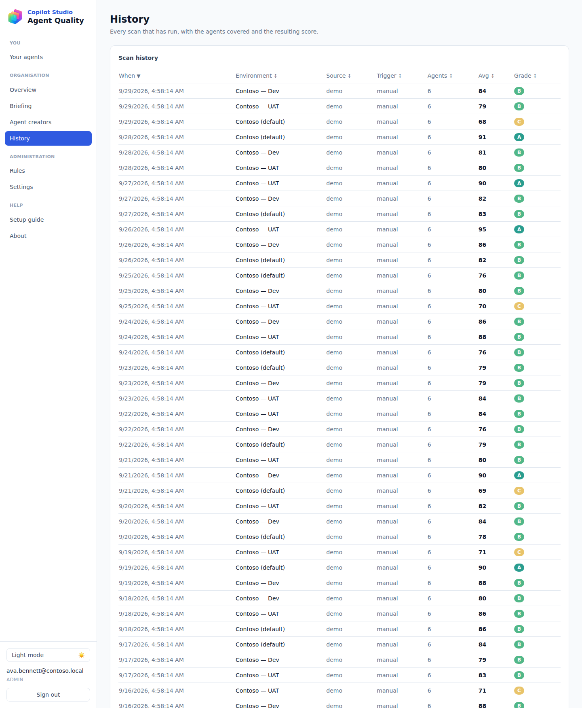

### Setup guide

Everything needed to connect the reporter to your environments — the app registration script, the Dataverse tables it needs read access to, the per-environment application user, and what to check when something looks wrong. Linked under **Help**; it used to be routed but reachable from nowhere.

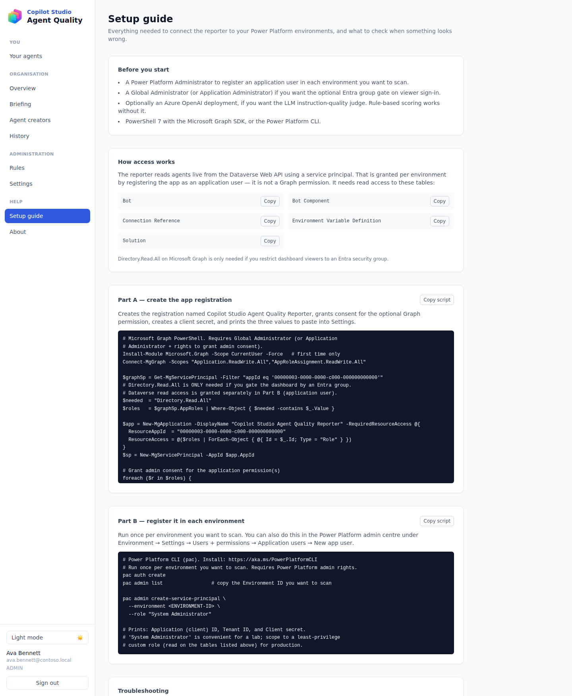

### About

App version/build, a plain-English explainer of how scoring works, data freshness, the rest of the suite, and credits.

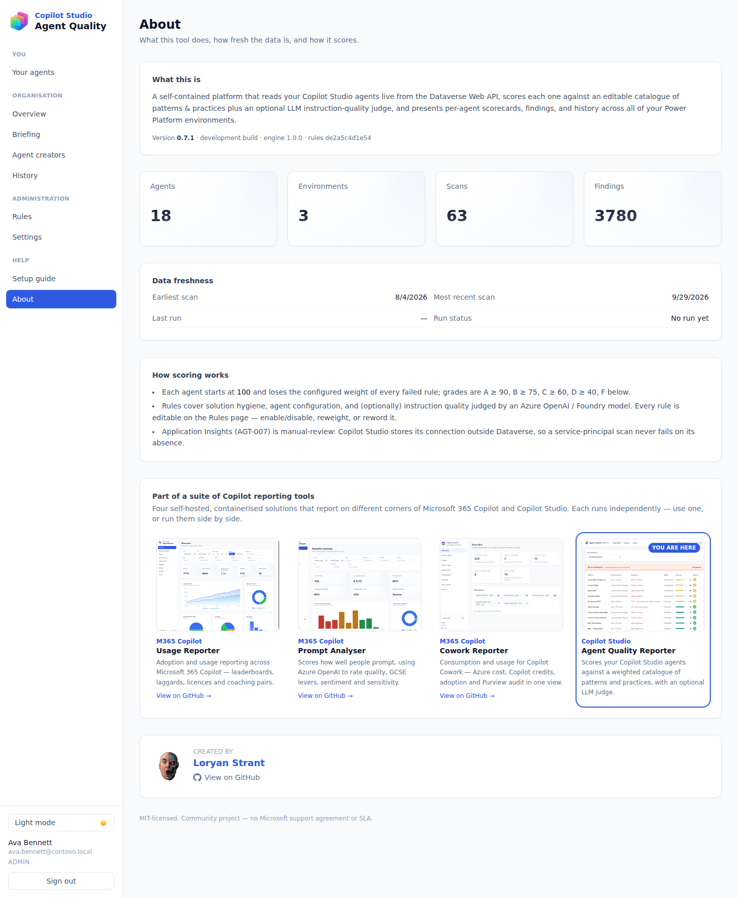

### Dark mode

Every page supports a light and dark theme. Every screenshot above has a dark
counterpart in [`docs/screenshots/`](docs/screenshots/):
[sign in](docs/screenshots/login-dark.png) ·
[your agents](docs/screenshots/personal-dark.png) ·
[overview](docs/screenshots/overview-dark.png) ·
[briefing](docs/screenshots/briefing-dark.png) ·
[agent creators](docs/screenshots/creators-dark.png) ·
[agent scorecard](docs/screenshots/agent-detail-dark.png) ·
[rules](docs/screenshots/rules-dark.png) ·
[history](docs/screenshots/history-dark.png) ·
[settings](docs/screenshots/admin-dark.png) ·
[setup guide](docs/screenshots/setup-guide-dark.png) ·
[about](docs/screenshots/about-dark.png).

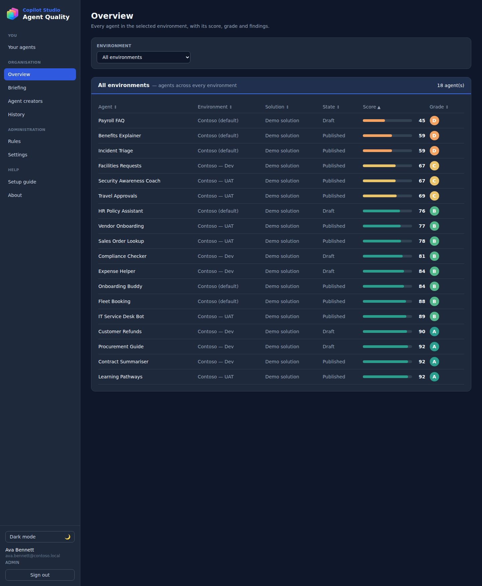

### Reading it without colour

Nothing in this app means anything by colour alone. A grade always carries its **letter**, a severity always carries its **word**, a score always carries its **number**, and the briefing's movement marks are **▲ ▼ ■** rather than three shades of the same idea. Colour reinforces; it never carries.

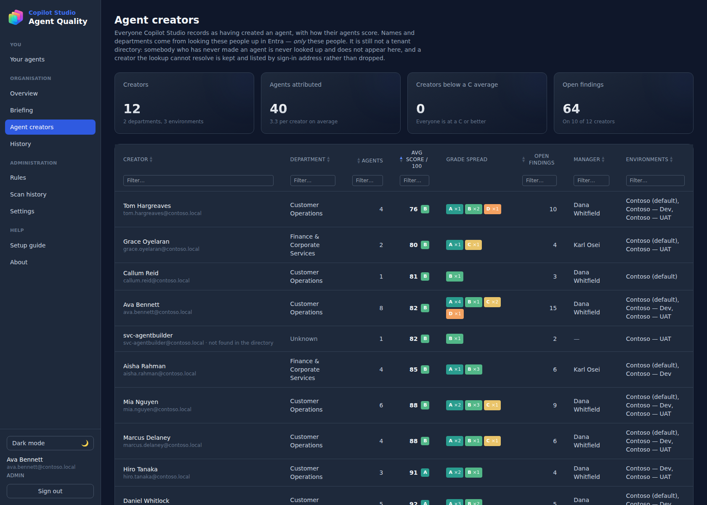


## Deploy to Azure (one click)

The button provisions everything into a resource group of your choice: a PostgreSQL flexible
server, a Container Apps environment, and the **api** + **worker** container apps (pulled as
prebuilt public images from GitHub Container Registry). You only enter an **admin password** — the
database password and encryption keys are generated for you. When the deployment finishes, open the
`dashboardUrl` output, sign in, and complete the in-app **Settings** page to connect your Dataverse
service principal.

To deploy from source with `azd` instead, see [`docs/deploy.md`](docs/deploy.md).

## After it's deployed

**1. Open the dashboard.** In the portal, go to your resource group → open the deployment (or
Deployments → the `Microsoft.Template` run) → **Outputs** → copy **`dashboardUrl`**. That is your app.
It's served by the **`…-api-…`** Container App (the `…-worker-…` one has no web UI — it just runs
scheduled scanning in the background). You can also get the URL from the api Container App's
**Overview → Application Url**.

**2. Sign in.** Username is what you set as **admin username** (default `admin`); password is the
**admin password** you chose at deploy time. The admin console is always password-protected.

**3. Connect your Dataverse service principal.** Go to **Settings**. The setup guide walks you through
creating one Entra **app registration** with the **Dynamics CRM `user_impersonation`** application
permission, then registering it as an **application user** (with a role that can read bots, bot
components, and solutions) in each environment you scan. Paste **Tenant ID**, **Client ID**, and
**Client secret**. Optionally add an **Azure OpenAI / Foundry** base URL, model, and key to enable
the LLM instruction-quality judge.

**4. Add environments and scan.** On **Settings**, **Add environment** → paste its Dataverse org URL
(e.g. `https://org.crm.dynamics.com`) → **Test** → **Run now** (or **Run all environments**). The
environment card shows the last-scan time and agent count; the Overview page shows live scan
progress. You can **Edit** an environment later to rename it or add Application Insights details.

### Restrictions and things to know

- **Application Insights (AGT-007)** can't be read by a service principal — Copilot Studio stores its
  connection outside Dataverse and its bot-management API rejects app-only tokens. This rule is
  therefore **manual-review** and never fails on absence. Connecting an environment's App Insights in
  Admin lets telemetry be confirmed automatically instead.
- **A scan that finds no agents** usually means the app registration isn't registered as an
  **application user** in that environment, or its security role can't read `bot` rows. Re-check the
  setup guide's step 2 and use **Test** on the environment.
- **The service principal needs per-environment access** — one app registration, added as an
  application user in *each* environment you want to scan.

### Enabling Entra ID single sign-on (optional)

By default the dashboard is protected by the single admin password. You can additionally let
colleagues sign in with their **work account**. They are viewers unless they are in the
**Admin group** configured in Settings, whose members administer the app on sign-in — see
[Authentication](#authentication).

Sign-in is performed by the app itself, so it works the same wherever you run it: Azure, Docker
on a NAS, Kubernetes, anywhere. There is nothing to configure on the hosting platform.

It reuses the **same app registration** you already entered for scanning, so there is no second
set of credentials to manage:

1. Sign in as the admin and open **Settings**.
2. Copy the **redirect URI** shown under *Sign in with Microsoft (optional)*.
3. In the Entra portal, open your app registration → **Authentication → Add a platform → Web**,
   and paste that redirect URI.
4. Optionally set a **report access group ID** in Settings to restrict who can view the dashboard.
   If you do, add a **groups** claim under **Token configuration** on the app registration.

The sign-in page then shows a **"Sign in with Microsoft"** button.

> **Behind a reverse proxy?** The app works out its own public address from the request. If your
> proxy doesn't pass the standard forwarded headers, set `PUBLIC_BASE_URL` (for example
> `https://aqp.contoso.com`) so the redirect URI is correct.

Full details: [`docs/deploy.md`](docs/deploy.md#entra-single-sign-on-optional).

### Your agents vs. the organisation view

Anyone who signs in with their work account lands on **Your agents** — the agents Copilot Studio
records *them* as the maker of, with each one's latest score and anything still open. The page is
built entirely from the signed-in identity in the token: there is no "which user?" parameter
anywhere in the personal API, because a parameter would let one viewer read another person's
agents by editing a URL. Matching is on `created_by_upn`, compared case-insensitively (Dataverse
and Entra do not agree on casing). Agents with no recorded maker belong to nobody.

Stepping across to the **Organisation** view — every agent in every environment, plus scan history —
is controlled by a separate **Organisation view group ID** in **Settings**:

- **Leave it blank and the organisation view stays open** to everyone who can sign in. That is the
  behaviour existing deployments already have, and upgrading must not lock anyone out.
- Set it to an Entra group object ID and only members of that group (plus the password admin) can
  see organisation-wide reporting. Everyone else keeps their own personal view, and the
  organisation links are shown locked rather than hidden, so it is obvious what to ask for.

It is deliberately **separate from the report access group ID**: that one decides who may sign in at
all, this one decides who may see everyone else's data. Membership is checked on **every request**,
never baked into the token, so removing someone from the group takes effect immediately rather
than when their token expires.

### Where to find run history, logs, and errors

- **In the app:** **Scan history** (under Administration) is the run log — every scan and directory
  lookup, with duration, what it wrote and any failure reason. The **Overview** page shows live scan
  progress, **History** shows how quality has moved, and each environment card on **Settings** shows
  its last-scan time and agent count.
- **Container logs (the real detail):** manual **Run now** / **Scan all** run inside the
  **`…-api-…`** Container App — open it → **Monitoring → Log stream** (live), or **Logs** to query
  `ContainerAppConsoleLogs_CL`. Scheduled background scans run in the **`…-worker-…`** Container App —
  check its log stream for scheduled-run errors.


## What it scores

Findings come from a **rule catalogue** ([`engine/rules/rule-catalogue.md`](engine/rules/rule-catalogue.md)) that maps each rule back to a patterns & practices reference. Rules are grouped into:

- **Solution hygiene** — the agent lives in a custom solution (not the default), a custom publisher prefix, a non-default version, connection references instead of hardcoded connections, and environment variables for env-specific values.
- **Agent configuration** — display name, meaningful description, substantive (but not excessive) instructions, user-created or customised topics, suggested prompts, Application Insights, a GA/default model, and a custom icon.
- **Instruction quality (LLM judge, optional)** — clarity, persona, scope discipline, orchestrator/child patterns, and output-format guidance, scored by an Azure OpenAI / Foundry model against the instructions.

Every rule is **editable** from the Rules page: enable/disable it, change its scoring weight, or reword its explanation. Scores are `100 − Σ(weights of failed rules)`, graded A ≥ 90, B ≥ 75, C ≥ 60, D ≥ 40, F below.

### What it does with the scores

- **Executive briefing** — the tenant in a few sentences, with this period against the one before it: agents, average score, grade mix, open findings by severity, the rules failing most often, and the lowest-scoring agents. Deterministic by design — every figure is SQL and every sentence is assembled from fixed thresholds, so a briefing can never invent a number in front of a customer.
- **Agent creators** — everyone recorded as having made an agent, with their name, department and manager, agent count, average score and grade, grade spread, open findings and environments. Sorted worst-first and filterable per column. The directory details are an Entra lookup of **these people only** — never a tenant sync — and an unresolvable creator is kept, listed by sign-in address.
- **Your agents** — the personal view, derived entirely from the signed-in identity in the token, with score-per-scan over time and a you / your team / all-agent-creators comparison. Both group series are withheld below five other people, and the percentile with them, so the comparison can never expose an individual's figures. The viewer keeps their own figures either way.
- **History** — average score over time with the best-to-worst band behind it and the biggest movers since each agent was last measured, filterable by environment, creator and agent.
- **Scan history** — the run log, under Administration: every scan and directory lookup with its kind, duration, what it wrote, and its failure reason. Part-finished scans are flagged.
- **Admin by Entra group** — administration can be granted to the members of a security group instead of being one shared password. Membership is re-read on every request, so removing someone bites in minutes rather than at their next sign-in, and an unset group grants admin to nobody.
- **Who is signed in, by name** — the sidebar shows the Entra display name above the UPN above the role, rather than an email address on its own.

Everything above reads correctly without colour: grades carry their letter, severities their word.

> **Application Insights (AGT-007):** Copilot Studio stores the App Insights connection outside Dataverse, and its bot-management API rejects app-only tokens, so a service-principal scan can't read it. This rule is therefore **manual-review** — it never fails on absence. Connect an environment's App Insights in Admin and telemetry is confirmed automatically.

## Prerequisites & permissions

- A **Power Platform Administrator** to register an application user in each environment you want
  to scan.
- A **Global Administrator** (or Application Administrator) only if you want the optional Entra
  group gate on viewer sign-in.
- Optionally an **Azure OpenAI** deployment for the LLM instruction-quality judge. Rule-based
  scoring works without it.
- PowerShell 7 with the Microsoft Graph SDK, or the Power Platform CLI.

Agents are read **live from the Dataverse Web API** using a service principal. That access is
granted per environment by registering the app as an **application user** — it is not a Graph
permission. It needs read access to these tables:

| Table | Why |
| --- | --- |
| Bot | The agents themselves — name, description, instructions, publish state. |
| Bot Component | Topics, knowledge sources and other components used for scoring. |
| Connection Reference | Detects connections used by the agent. |
| Environment Variable Definition | Detects configuration handling. |
| Solution | Solution hygiene rules (managed/unmanaged, publisher prefix). |

Two Microsoft Graph **application** permissions are optional, and each buys one thing:

| Permission | Needed for | Without it |
| --- | --- | --- |
| `Directory.Read.All` | Restricting sign-in, the organisation view or admin rights to an Entra security group | The group gates cannot be used; the password account is unaffected |
| `User.Read.All` | Resolving agent creators to names, departments and managers — which is what makes the Agent creators listing readable and the you/your-team comparison possible | Creators show as sign-in addresses, nobody gets a team comparison, and Settings names the missing permission |

`User.Read.All` is a consent step for a Global Administrator (or Application Administrator), on the
same app registration the Dataverse scan already uses. The lookup only ever asks Graph about UPNs
already stamped on an agent — one request per person, `GET /users/{upn}` — and there is no call to
the user collection in the codebase at all, so it cannot enumerate your directory.

Setup is two parts, both scripted. The in-app **Setup guide** page and the Settings wizard carry
copy-paste scripts for each:

**Part A — create the app registration** (Microsoft Graph PowerShell). Creates the registration,
grants consent for the optional Graph permission, creates a client secret, and prints the Tenant ID,
Client ID and secret.

**Part B — register it per environment** (Power Platform CLI):

```powershell
# Power Platform CLI (pac). Install: https://aka.ms/PowerPlatformCLI
# Run once per environment you want to scan. Requires Power Platform admin rights.
pac auth create
pac admin list                 # copy the Environment ID you want to scan

pac admin create-service-principal \
  --environment <ENVIRONMENT-ID> \
  --role "System Administrator"

# Prints: Application (client) ID, Tenant ID, and Client secret.
# 'System Administrator' is convenient for a lab; scope to a least-privilege
# custom role (read on the tables listed above) for production.
```

You can do Part B in the Power Platform admin centre instead, under **Environment → Settings →
Users + permissions → Application users → New app user**.

## Quick start (local)

```powershell
# 1. Create your env file and a Fernet key
Copy-Item .env.example .env
python -c "from cryptography.fernet import Fernet; print(Fernet.generate_key().decode())"
# paste the printed value into FERNET_KEY in .env

# 2. Start the production stack (api + worker + postgres)
docker compose up -d
```

- **Dashboard + API:** http://localhost:8002
- **API + Swagger docs:** http://localhost:8002/docs
- **API health check:** http://localhost:8002/health
- **Postgres:** localhost:5434 (user/pass/db all `agentquality` by default)

This is the production stack: it runs prebuilt images with no bind mounts and no
auto-reload, and the API serves the built dashboard itself — so there is no separate
frontend container or web port. `docker compose up` pulls the published images; add
`--build` to build them locally instead.

Every solution in the suite owns a distinct port block, so all four can run side by
side without clashing:

| Solution | API / dashboard | Postgres |
|---|---|---|
| M365 Copilot Usage Reporter | 8000 | 5432 |
| M365 Copilot Cowork Reporter | 8001 | 5433 |
| **Copilot Studio Agent Quality Reporter** | **8002** | **5434** |
| M365 Copilot Prompt Analyser | 8003 | 5435 |

Override `API_PORT` / `DB_PORT` in `.env` to move them. Only the host side changes —
container-internal wiring is unaffected.

### Developing against it

For hot-reload while working on the code, layer the dev override on top. It builds
locally, bind-mounts the source, enables `uvicorn --reload` and runs the Vite dev
server:

```powershell
docker compose -f docker-compose.yml -f docker-compose.dev.yml up --build
```

The dev dashboard is then on http://localhost:5175 (`WEB_PORT`), with the API still
on 8002.

On first start an admin login is seeded from `ADMIN_USERNAME` / `ADMIN_PASSWORD` in `.env`
(defaults `admin` / `change-me` — change these).

## First-run checklist

1. `docker compose up` (or deploy to Azure).
2. Sign in with `ADMIN_USERNAME` / `ADMIN_PASSWORD` (seeded automatically on first start).
3. **Settings** → follow the guided wizard for Part A, then enter Tenant ID, Client ID and Client
   secret and **Save**.
4. Add each environment (display name + Dataverse org URL), run Part B for it, then **Test**.
5. **Run now** for one environment, or **Run all environments**.
6. Optionally configure Azure OpenAI to enable the LLM judge, and tune weights on **Rules**.

Just evaluating? Skip steps 3–5 and use **Settings → Demo data → Load demo data** instead.

## Authentication

- **Admin console** is always **password-protected** (JWT, seeded admin user). That account is
  break-glass and is not going away: it is how you sign in the first time and how you set the
  admin group in the first place.
- **Admin by group (optional)** — put an Entra security group's object ID in the *Admin group ID*
  field in **Settings** and its members administer the app when they sign in with Entra.
  Membership is evaluated **per request**, not baked into the token, so removing someone takes
  effect within minutes rather than when their token expires. Leaving the field blank grants
  admin to **nobody** — it fails closed, deliberately the opposite of the organisation-view
  field, because administration has always been an explicit grant and upgrading must not hand it
  to everyone who can sign in.
- **Entra single sign-on (optional)** — the app runs the OpenID Connect sign-in itself, reusing the
  service principal you already configured, so colleagues can view the dashboard with their work
  account on any host. See [docs/deploy.md](docs/deploy.md#entra-single-sign-on-optional).
- **Personal view** — people who sign in with a work account see the agents they created, derived
  from the token. **Organisation-wide** reporting is gated by the *Organisation view group ID*
  (blank = open to everyone who can sign in). See
  [Your agents vs. the organisation view](#your-agents-vs-the-organisation-view).


## Data & privacy notes

- Agent **instructions and descriptions** are read from Dataverse for scoring. If the LLM judge is
  enabled, instruction text is sent to **your own** Azure OpenAI deployment — never to any
  third-party service. Disable the judge and nothing leaves your subscription at all.
- The Dataverse **client secret** and the Azure OpenAI **key** are encrypted at rest with a Fernet
  key and are write-only in the API: they can be set and replaced, never read back.
- Scores are about **agent quality and hygiene**, not the people who built them. Creator names are
  shown so you know who to help, not to rank anyone.
- The **creator lookup** sends Graph only the sign-in addresses already recorded on agents, and
  stores only display name, department, job title, office and manager. It never enumerates the
  directory, and it never looks up somebody who has not built an agent. Every comparison series
  is an average over at least five other people — the team and the creator population alike, with
  the percentile withheld alongside — so an individual's figures are never shown to a colleague.
  In a tenant where only a handful of people build agents, that means the comparison shows your
  own numbers and says why the rest is missing.
- Application Insights (AGT-007) is always manual-review: Copilot Studio stores that connection
  outside Dataverse, so a service-principal scan cannot confirm it either way.
- Demo data is clearly labelled as such in Settings, and is only ever created or removed by an
  explicit action.

## License

MIT. Community project — no Microsoft support agreement or SLA.
